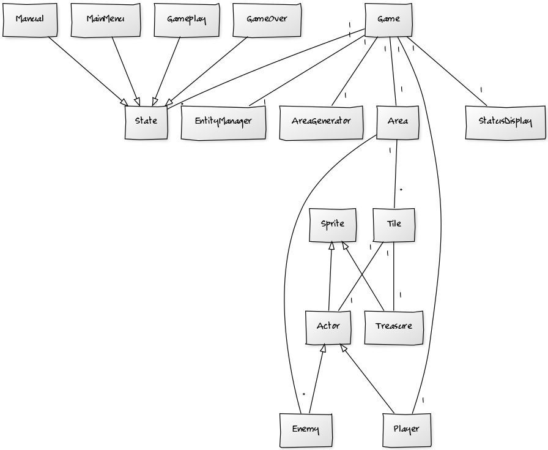

**Aihe:** Luolastoseikkailu-peli

**Käyttäjät:** Pelaaja

Vuoropohjainen peli, jossa pelaaja voi liikuttaa pelihahmoa kentällä. Pelikentällä on sekä kerättäviä aarteita että vihollisia, joita vastaan pelaaja voi taistella. Peli päättyy, kun pelaaja kuolee tai kun kaikki kentän viholliset ovat kuolleet.

**Rakenne:**
entities: 
Sprite: abstrakti luokka pelin olioiden sijaintien ja kuvien muistamiseen.
Treasure: tallentaa pelissä kerättävien aarteiden pistearvon ja palautettavien elämäpisteiden määrän.
Actor: abstrakti luokka itsestään toimivien peliolioiden liikkumiseen ja taistelemiseen.
Enemy: pelin vihollisten liikkumiskäyttäytyminen.
Player: tallentaa pelaajan pisteet.
SpriteEnum: sisältää peliolioiden ja tiilien kuvien tiedostosijainnit ja lataa kuvat Image-olioiksi tarvittaessa.
EntityManager: hoitaa peliolioiden vuorossa tapahtuvat toiminnot.

gamestates: 
State: abstrakti luokka joka tarjoaa metodit pelitilanteen päivittämiseen ja piirtämiseen.
PlayState: päivittää ja piirtää pelitilanteen, vaihtaa pelitilanteen EndStateksi pelin päätyttyä.
EndState: piirtää pelin päättymisen, vaihtaa pelitilanteen PlayStateksi pelaajan aloittaessa uuden pelin.

gui: 
Screen: pääluokka, käynnistää käyttöliittymän.

logic: 
Tile: sisältää tiilen tyypin ja mahdollisesti yhden peliolion ja esineen.
Area: sisältää pelikentän 2d-arrayna Tile-olioita. Tarjoaa metodit peliolioiden poistamiseen ja siirtämiseen tiilestä toiseen.
Room: sisältää generoitavien huoneiden koordinaatit ja tarjoaa metodin huoneiden päällekkäisyyden tarkistamiseen.
AreaGenerator: tarjoaa metodit satunnaisen pelikentän generointiin.
AreaLoader: tarjoaa metodit pelikentän luontiin tekstitiedoston pohjalta.
Game: kokoaa yhteen pelin toiminnan kannalta olennaiset osat.

status: 
StatusDisplay: seuraa pelaajan ja peliolioiden tilaa ja piirtää sen näytölle.

